# hello gpu

参考 : 有许多非常专业的网站提供了更加详细，全面的解释

[Learn OpenGL 主页](https://learnopengl-cn.github.io/)

[极客学院 曲面细分教程](http://wiki.jikexueyuan.com/project/modern-opengl-tutorial/tutorial30.html)

[Render Doc 官网](https://renderdoc.org/)

[DX OS 解释](https://docs.microsoft.com/en-us/windows/desktop/direct3d11/d3d10-graphics-programming-guide-output-stream-stage)

简写 : 在初次出现时会用全称，后续直接用简写代替
``` python
DrawCall              : "dc"      #一次渲染调用
# 数个着色器或阶段的简称
Input Assembler Stage : "IA"      #输入装配 阶段
Vertex-Shader Stage   : "VS"      #顶点着色 阶段
Tessellation Stage    : "TS"      #曲面细分 阶段
Geometry-Shader Stage : "GS"      #几何着色 阶段
OutputStream Stage    : "OS"      #流输出   阶段
```

# GPU
从最简单的像素颜色插值，到如今的渲染管线，是经过了几代人的努力的结果。

在过去的20年，图形硬件发生了不可思议的转变。在 1999 年，NVIDA发布了 GeForce256，于是 NVIDA 创造了GPU这个术语。

GPU从完全 Fixed-Function 到如今的 highly Programmable 的形态，经过了很多改变。

现在，为了效率考虑，有些部分仍然是 Fixed-Function，但整体的趋势是变得 Programmable and flexible。

GPU 专注于高并发的任务处理，并且拥有极快的速度。

甚至对某些功能 (rapidly accessing texture images，快速访问图片纹理)，设计了专门的芯片。

在这里，我们会谈到，GPU如何用他的高并行结构来完成渲染程序的。

有一个定义， **a shader core**，可以看成一个小的处理器，它能处理一些相对独立的任务，比如 计算一个顶点的变化，或者计算 一个片元的颜色。

在渲染时，每一秒都将有数十亿的 **shader invocations**，这指就是 shader 程序运行的实例。（一个 shader core 运行一次 shader program）

对于所有的处理器，延时是一个必须要面对的问题。相比于存储在寄存器中数据，从缓存中获取肯定更慢，而从内存中获取延时就会更加明显了。

对于GPU来说，如何处理等待数据的读取时一个很重要的话题（比如，获取一张纹理贴图）。

## 并行数据结构
```
Much of a GPU’s chip area is dedicated to a large set of processors, 
called shader cores, often numbering in the thousands.
```
GPU 的大部分芯片区域是一大堆处理器的集合，称为 shader cores。通常有上千个。

>* GPU 大规模并行处理数据
>>* 顶点数据或者像素数据，其结构是完全一样的，相似性极高
>>* 这些调用(invocatio, 这里指一次vs或者ps的执行)都是独立的。
我们在vs或者ps中，不会去获得邻近调用的信息，也没有一个共享的可写的内存。（可读倒是有)
>>* 缺点:
这样的规则会导致一些不方便的地方。举个例子，在 Learn OpenGL 教程中，我们做高斯模糊时，并不能在ps中获得邻近的点的信息。
而是做了2次dc。


```
Say a mesh is rasterized and two thousand pixels have fragments to be processed;
```
RTR在这里有个，2000个片元待处理的例子。

>* 只有一个 shader core
>>* 它在读取纹理是，会需要内存的访问，要花上几百上千个时钟周期，这段时间，只能做单纯的等待。
>* 优化1，在等待时，我们给每个片元一点存储空间，遇到等待时切换环境
>>* 在读取纹理时，切换环境（处理下一个片元），继续执行。即，遇到需要 stall 的地方， switch。

在这种架构中，我们通过切换来隐藏延迟。通过分离数据中的指令逻辑，GPU提供了一种更进一步的设计。
SIMD （single instruction, multiple data）。通过这种形式，对固定数量的着色器程序执行相同的指令。


在现代GPU术语中，我们的2000个片段调用的顶点着色程序的运行实例，称之为线程。

和CPU不一样的是，它包含了一小块输入内容的内存，和一部分执行指令的寄存器。
（正因为它如此相对独立，我们在切换时的代价也很低)

这些执行相同 shader 程序的线程会被捆绑为组，在NVIDA称为 wrap，在AMD中称为 wavefront。

一组线程会被一定数量的 shader core 执行，通常是 8-64 个。

在SIMD中，每个线程对于一条通道。


>* 2000 线程，63 组的例子
>>* 以组为单位执行指令，遇到内存读取时（图中的txr指令），交换组
>>* 缺点，如果组不够多，在第三组被执行完成后，我们还是会出现真正的延迟。
>>* 最主要的原因，是线程使用的寄存器的数量。因为寄存器的总数是有限的，
线程关联的寄存器越多，则驻留在GPU内的线程就越少，导致可以分出的组也越少。
>>* 还有一个原因就是，读取内存的频率。
>>* 以及，if或循环语句引起的动态分支。
```
However, if some threads, or even one thread, take
the alternate path, then the warp must execute both branches, throwing away the
results not needed by each particular thread [530, 945].
```
因为我们是 SIMD 模式，所以只要有一个线程有不同的分支，所有的内容都要跑一遍不同的分支。

这被称为线程分歧(thread divergence)

## 管线总览

在之前，我们可能提及到了，管线中有些功能是 Fixed-Function，一些是 Programmable,，在这里给出总览。


其中:
>* 绿色: 完全可编程 （programmable）
>* 黄色：可配置，不可编程（configurable）
>* 蓝色：固定功能 （Fixed-Function）
>* 虚线：可选 (Optional)
```
The logical model can help you reason about what affects performance, but it should
not be mistaken for the way the GPU actually implements the pipeline.
```
RTR提醒: 逻辑模型只是让你更好的理解，真正的GPU实现不一定如此。

## 可编程的渲染阶段
现代的着色器使用统一的着色器设计（shader design），这意味着：
>* 所有的着色器，顶点，像素，几何，曲面细分相关，都是在一个通用的编程模型下。
>* 他们使用相同指令集架构。
>* 我们使用 通用渲染核心（common-shader core) 来支持该架构，让GPU来动态处理 核心 的工作分配。

着色器语言是类似C语言的（GLSL HLSL）。

比如DX的 HLSL 能编译成 DXIL 的中间虚拟机的机器码，来实现硬件无关 和 离线编译。

中间语言通过特定GPU的硬件转化为 ISA（指令集）。

但是游戏主机上的shader就没有中间语言这一步，因为只有一个系统的指令集。

```
On modern GPUs 
32-bit integers and 
64-bit floats 
are also supported natively. 
```

现代GPU支持32位整数和64位浮点数。

浮点数向量通常包含位置（xyzw），法线，矩阵行，颜色（rgba），以及纹理坐标（uvwq）。

整数通常用于表示计数器，下标，或者位掩码。

并支持聚合性数据，如结构体，数组，以及矩阵。

---
在每个可编程的着色阶段，有2种形式的输入。
>* uniform inputs（统一的输入）: 在整个dc流程中不会改变的值，贴图纹理是一个典型的例子。
>* varying inputs（变化的输入）: 来自三角形顶点或者光栅化的数据。


底层的虚拟机为各种不同类型的输入输出提供了相应的寄存器。

可以发现，统一输入的寄存器的数量比变化输入的寄存器数量要多。

是因为在整个dc中，统一输入的变量一旦存储数据，可以被所有的顶点和像素着色器重复使用。

而变化输入的寄存器，每个顶点或者像素都有不同的内容，所以他们的数量要少很多。

```
The virtual machine also has general-purpose temporary registers, which are used for scratch space.
All types of registers can be array-indexed using integer values in temporary registers.
```

临时寄存器有着很广泛的用途，可以做临时空间，也可以做索引 **TODO：暂时不能理解 临时寄存器的用处**


```
GL_MAX_VERTEX_UNIFORM_COMPONENTS
data returns one value, the maximum number of individual floating-point, integer, or boolean values that can be held in uniform variable storage for a vertex shader. The value must be at least 1024. See glUniform.

GL_MAX_VERTEX_UNIFORM_VECTORS
data returns one value, the maximum number of 4-vectors that may be held in uniform variable storage for the vertex shader. The value of GL_MAX_VERTEX_UNIFORM_VECTORS is equal to the value of GL_MAX_VERTEX_UNIFORM_COMPONENTS and must be at least 256.
```

这是一段查看 GL Constant Registers 的程序 **TODO：不知道为什么，block少了两**

---
注意的点
>* 尽量使用内置的数学函数，效率会高很多
>* if-loop 少用，用多了会导致不稳定的代码执行流变化，增加消耗

## 着色器和API的演变
*这一节的内容，讲的是GPU相关发展的历史，所以当成有趣的故事听听吧~*


可编程的着色框架起源于1984年Cook提出的 渲染树 的概念，并在此后提出了 RenderMan 这门渲染语言。


是不是跟 Phong 光照模型很像？

如今这种渲染模式仍被电影的渲染流程使用，不过加上了更多的标准（Open Shading Language (OSL)）

---


1996.10.1 3dfx Interactive 推出了第一款用户级别的图形处理硬件 ，这款显卡是完全 Fixed-Function 的。并很好的支持当时的游戏 Quake (雷神之锤)


```
there were several attempts to implement programmable shading operations 
in real time via multiple rendering passes.
```

1999 GeForce256 ，第一款被称为GPU的硬件出现，它是 configurable 的。

在出现支持 programmable 的 GPU 之前，人们通过 多个渲染过程的组合 来实现着色。（大致意思是这样）

2001，NVIDIA’s GeForce 3，第一款支持 vs 编程的GPU发行，支持 DX 8.0 以及 OpenGL。

```
These “programs” were not only limited in length
(12 instructions or less) but also lacked important functionality.
```
GeForce 3 中也支持像素着色器，但是只支持 12 条指令，缺少了许多重要的功能。

在当时，**Dependent texture reads**（纹理坐标可以是被计算出来的，而不是常变量），以及浮点数的存储都做不到。

而且着色器并不支持流控制（代码分支），所以条件术语都是通过计算2个值，或者通过插值实现。

DirectX 定义了 Shader Model (SM) 的概念，以此区分具有不同着色功能的硬件。

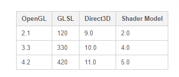

2002，DX 9 发布（对应 SM 2.0），支持真正的 vs和ps 可编程。

OpenGL 也同步支持了相应的拓展。

支持Dependent texture reads，浮点数存储，增加了指令，寄存器，贴图的上限，和流控制，因此着色器能够提供更加多样的效果。

着色器的长度和复杂性在不断增加，使得汇编的 SM 变得越来越麻烦。

于是，Microsoft 和 NVIDA 合作发行了 HLSL。

同一时间，OpenGL 发布了 GLSL。

这2种语言，深深受到了 C语言 和 renderman 的影响。

---

2004，SM 3.0推出，增加了动态流控制，以及进一步的优化。

基于 SM 3.0，2005 (Microsoft 推出了 Xbox 360) 以及 2006 （索尼推出了 PS3）。

以及2006，最后一款 fixed-function 的GPU（Nintendo’s Wii），在此之后，fixed-function 的GPU 退出历史舞台。

Shader语言也发展到，需要使用各种工具来创建和管理他们。

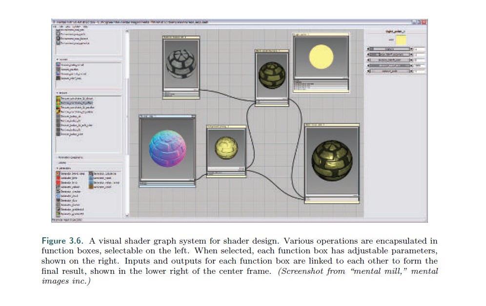

2006年底，SM 4.0，DX10 发布，增加了几个新特性，比如 gs 和 流输出。

SM 4.0 还为所有的着色器提供了统一的编程模型（对应 通用渲染核心common-shader core），并做了进一步优化。

同时，OpenGL 3.3 更新了 GLSL 3.0，提供了相似的 SM。

--

2009，DX11 和 SM5.0 发布，增加了曲面细分阶段着色器和计算着色器（ts cs）。

并且支持CPU的多核能力，来提高效率。

OpenGL 在 4.0 增加了 ts，4.3 增加了 cs。

DX和GL 对硬件的支持有明确的需求。

不同的是，DX是微软控制的API，并且会和AMD，NVIDIA，Intel以及一些游戏开发者合作，进行版本更新。

OpenGL因为由一个非营利组织开发（Khronos），所以他们的API功能一般会比DX要晚。

---

2013，AMD 推出了一个新的 API -- Mentle。

Mentle 的意义是，它剥离了一部分图形硬件的开销，并把这部分的控制权交给开发者。

通过这种结构，大大利用了CPU的多核处理优势。

2015，微软吸收了这个优点，推出了 DX12。

从DX11.3开始，就能够支持 VR 的开发，但DX12 是一个彻底重新的设计（更适用于多核）。

---

2014，苹果发布了它自己的 低消耗API，Metal。

在iphone5S 和 iPad Air上，Metal 进入了历史舞台。

相对于效率上的考虑，Metal 的优点是耗电量小，这对于移动设备来说是非常重要的。

这个API也有自己的 shader 语言。

AMD 把Mentle 给了 Khronos，2016，Vulkan 发布。

Vulkan 使用了一种新的高级中间语言 SPIRV，可以预编译，并在所有支持 SPIRV 的机器（非常广）上使用。

而且，它还可以用于非图形的GPU计算。

---

在移动设备上，使用的是 OpenGL ES。

ES 代表 内嵌系统(Embedded Systems) 的意思，因为这个API是专门为移动设备设计的。

OpenGL ES 1.0 是OpenGL 1.3 的简化版，而当时DX并没有对移动设备做支持。

2010年的发布的第一款ipad，就是用 OpenGL ES 1.1 的。

2007，发布了OpenGL ES 2.0 规范，并提供了可编程的着色。

它是基于 OpenGL 2.0 的，不向 ES 1.1 兼容。

2012，OpenGL ES 3.0 发布，提供了许多特性，比如多渲染目标(MRT)，实例化等。

OpenGL ES 3.1 增加了 cs， 3.2 增加了 gs ts，以及其他功能。

---

OpenGL ES 还有一个分支就是 WebGL。

2011， WebGL 1.0 相当于 OpenGL ES 2.0。

WebGL 2 相当于 OpenGL ES 3.0，更高的版本支持更多的GPU特性。

WebGL有以下的优点：
>* 1.它是跨平台的，适用于个人的所有计算机和几乎所有移动设备。
>* 2.驱动程序由浏览器处理。（一个浏览器不行，换一个就是了）
>* 3.代码是解释形的，不是编译形的，只需要文本编辑器就可以开发。
>* 4.浏览器自带debug功能。

[three.js](https://threejs.org/) 这是推荐的一个 WebGL 的网站。

## 顶点着色器


### IA

在vs阶段之前，有一个IA的阶段，它主要的工作是：

比如一个三角形，它是这样表示的:

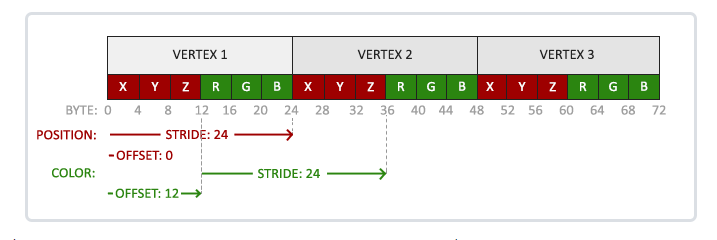

IA就将它转化为:

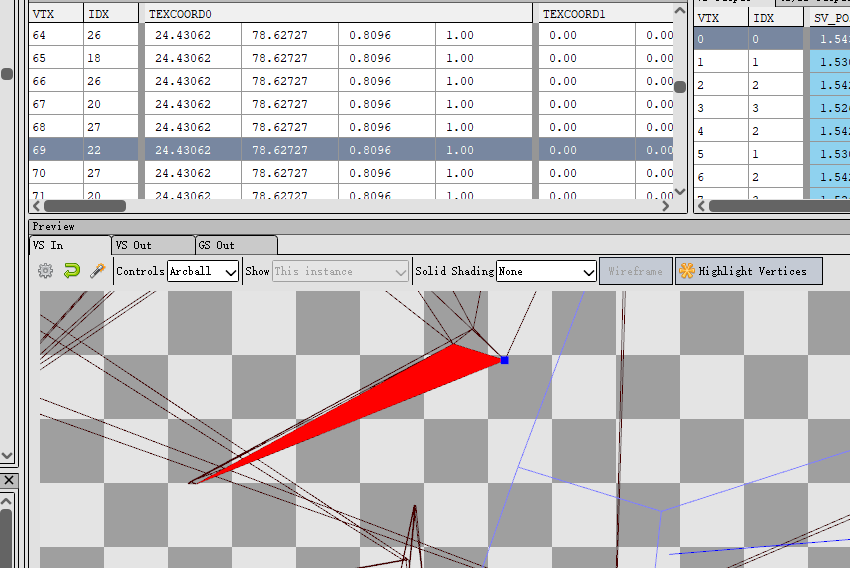

这些就是vs的输入。

### 法线

顶点输入中，有一个常见的属性就是法线坐标，需要了解的是：

法线往往代表的是该点的法线（或者是一个非常小的平面的法线），而不是三角形的法线。

所以，粗糙程度不同的网格，虽然顶点的位置可能一样，但法线会不同。

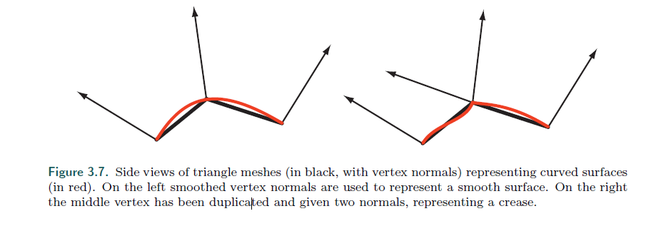

### 顶点处理

顶点处理有以下特点：
>* 仅仅处理传入顶点
>* 不能创建顶点，也不能销毁顶点。
>* 产生的数据只能给下一个阶段，不能和其他顶点着色程序有数据交互。

*因此，顶点数据流对GPU并行非常友好*

### 顶点着色器常见用途

这里只写一个标题

>* 实例化生成物体，只需要一份网格数据
>* 蒙皮和形变技术，动画效果
>* 程序模拟，旗帜，布料，水流的效果
>* 粒子生成
>* 镜头扭曲，热的雾气蒸腾，水波纹，页面卷曲
>* 地形高度纹理

## 曲面细分着色器

### API

曲面细分在 DX11，OpenGL 4.0，ES 3.2 及以上版本支持。

### ts流程

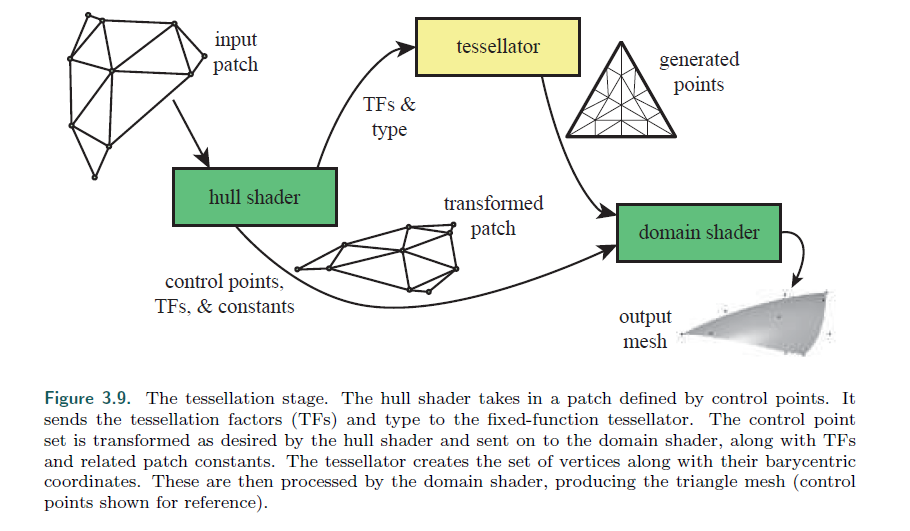

这是文中在DX中展示的流程，下图是GL的（我们以GL举例，因为DX的几个英文意思太玄乎了）

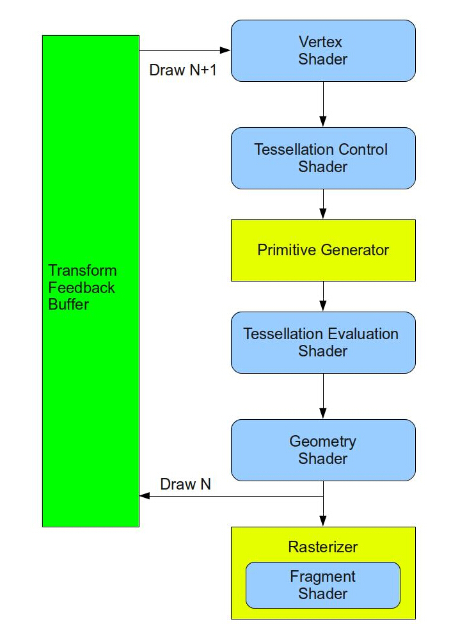

#### TCS

##### 输入

TCS，顾名思义，其CS的意思是 Control Points的意思，这些顶点并没有被定义成具体的三角形。

他们定义了一个几何曲面（或者曲线），当修改一个点时，整个曲面（线）也会改变。

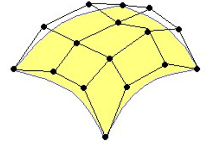

很熟悉吗？其实这是一个贝塞尔的曲面。

而这就是 tcs 的输入，他们被称为 patch。

##### 功能

那程序员会在 tcs 中做什么呢？

1. 我们可以在 tcs 对控制点进行一些，增删改的操作，然后输出一份修改后的 patch。

2. tcs 还需要计算一组被称为 **Tessellation Levels (TL) 的数据**，这个数据名为 曲面细分等级，显然，它就是进行曲面细分的重要数据。

##### 细分曲面域及对应的TL

API 会根据输出的 patch，将 patch 对应到3个不同曲面细分域。

矩形，三角形，等值线。

对应的TL有： In/Out TL，In/Out TL，Out TL

#### PG

在这里可以注意到，tessellator 或者 Primitive Generator 都用特殊的颜色标记

因为是写死在硬件上的（Fixed-Function），功能非常纯粹，就是生成一个空间下的顶点信息和网格。

##### 空间

每个曲面细分域对应不同的空间：

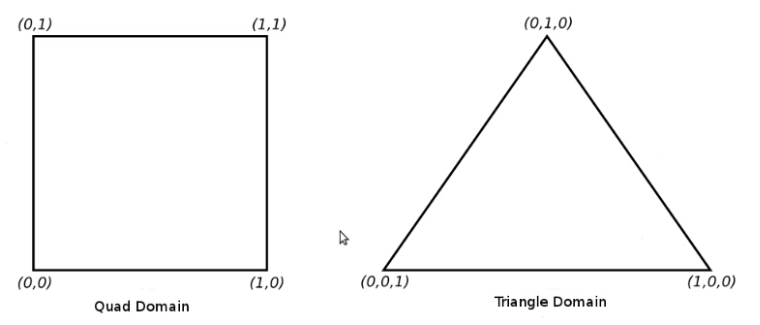

等值线就是一条直线域。

对于矩形，其In，Out分别代表，内部横竖分为几块，外边分为几等份。

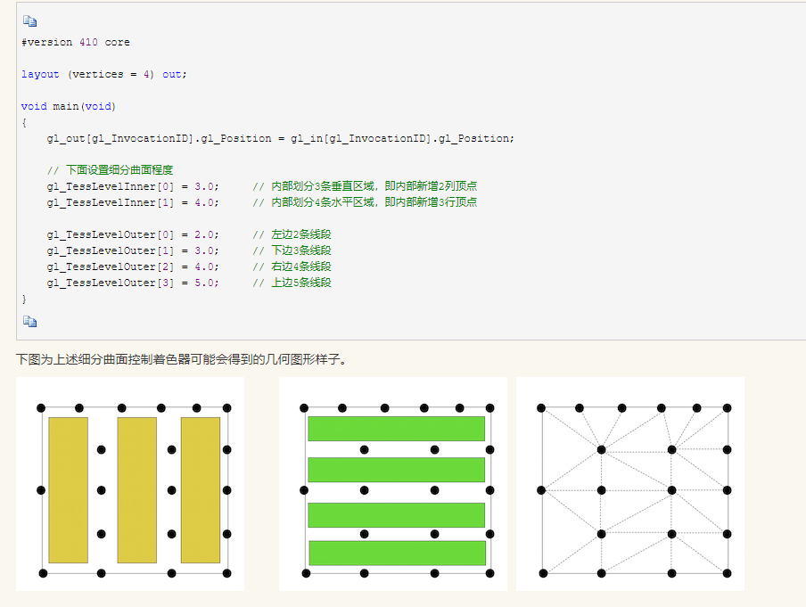

对于三角形，Out一样是外边被分为几块，In的含义比较模糊。

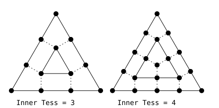

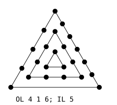

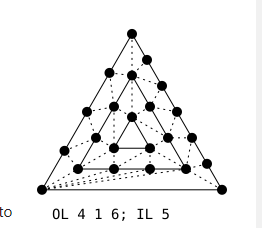

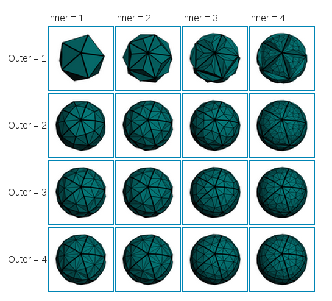

自己悟吧。

对于直线，只有Out。


