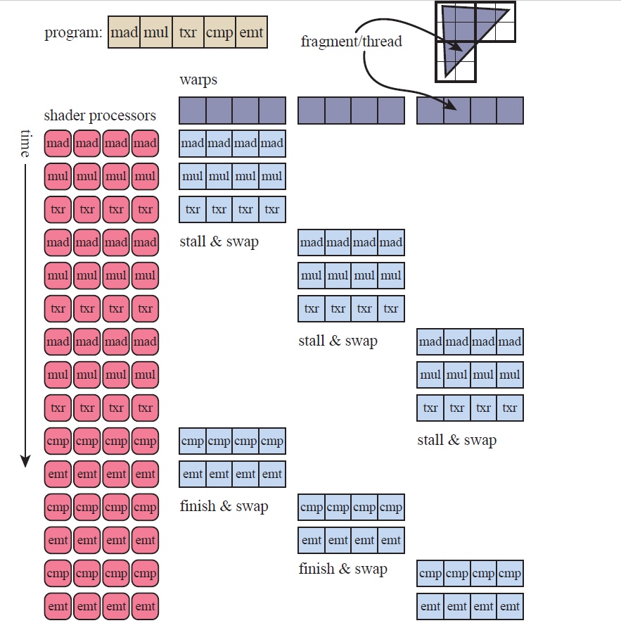
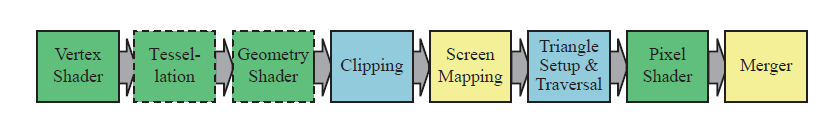
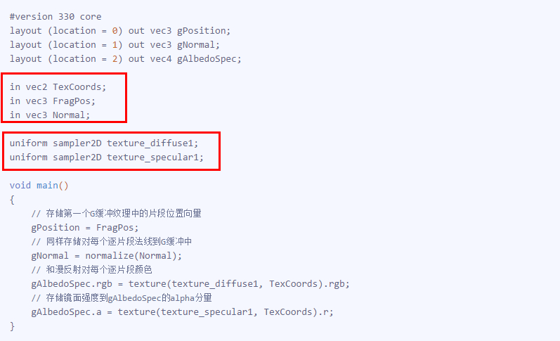
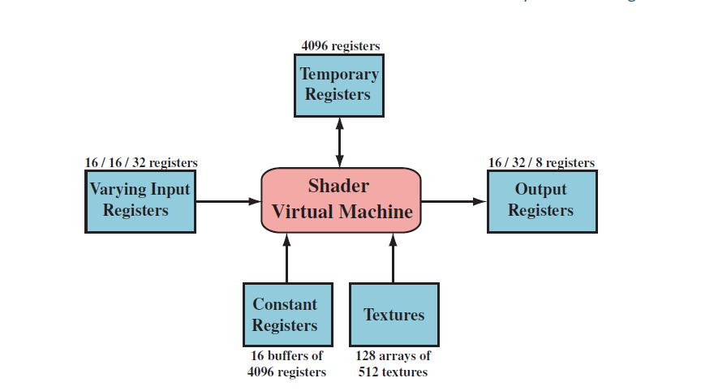
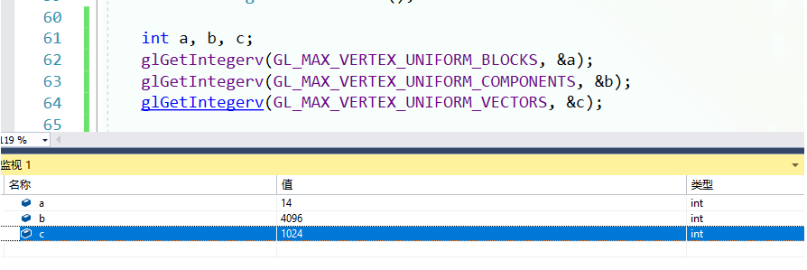
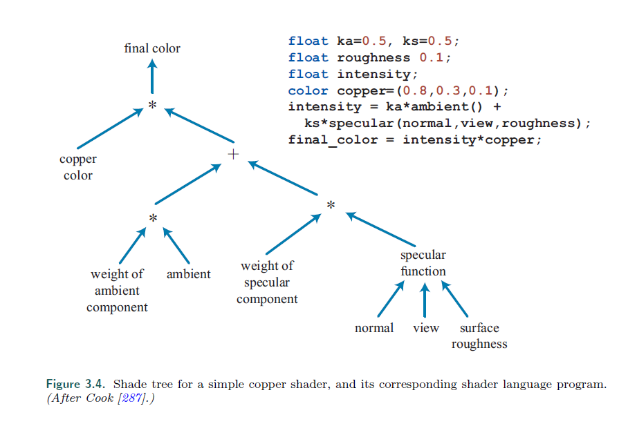
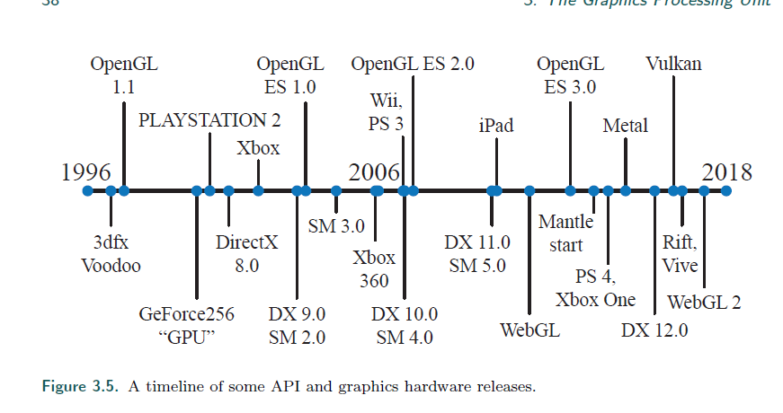

# hello gpu

参考 : 有许多非常专业的网站提供了更加详细，全面的解释

[Learn OpenGL 主页](https://learnopengl-cn.github.io/)

[极客学院 曲面细分教程](http://wiki.jikexueyuan.com/project/modern-opengl-tutorial/tutorial30.html)

[Render Doc 官网](https://renderdoc.org/)

[DX OS 解释](https://docs.microsoft.com/en-us/windows/desktop/direct3d11/d3d10-graphics-programming-guide-output-stream-stage)

简写 : 在初次出现时会用全称，后续直接用简写代替
``` python
DrawCall              : "dc"      #一次渲染调用
# 数个着色器或阶段的简称
Input Assembler Stage : "IA"      #输入装配 阶段
Vertex-Shader Stage   : "VS"      #顶点着色 阶段
Tessellation Stage    : "TS"      #曲面细分 阶段
Geometry-Shader Stage : "GS"      #几何着色 阶段
OutputStream Stage    : "OS"      #流输出   阶段
```

# GPU
从最简单的像素颜色插值，到如今的渲染管线，是经过了几代人的努力的结果。

在过去的20年，图形硬件发生了不可思议的转变。在 1999 年，NVIDA发布了 GeForce256，于是 NVIDA 创造了GPU这个术语。

GPU从完全 Fixed-Function 到如今的 highly Programmable 的形态，经过了很多改变。

现在，为了效率考虑，有些部分仍然是 Fixed-Function，但整体的趋势是变得 Programmable and flexible。

GPU 专注于高并发的任务处理，并且拥有极快的速度。

甚至对某些功能 (rapidly accessing texture images，快速访问图片纹理)，设计了专门的芯片。

在这里，我们会谈到，GPU如何用他的高并行结构来完成渲染程序的。

有一个定义， **a shader core**，可以看成一个小的处理器，它能处理一些相对独立的任务，比如 计算一个顶点的变化，或者计算 一个片元的颜色。

在渲染时，每一秒都将有数十亿的 **shader invocations**，这指就是 shader 程序运行的实例。（一个 shader core 运行一次 shader program）

对于所有的处理器，延时是一个必须要面对的问题。相比于存储在寄存器中数据，从缓存中获取肯定更慢，而从内存中获取延时就会更加明显了。

对于GPU来说，如何处理等待数据的读取时一个很重要的话题（比如，获取一张纹理贴图）。

## 并行数据结构
```
Much of a GPU’s chip area is dedicated to a large set of processors, 
called shader cores, often numbering in the thousands.
```
GPU 的大部分芯片区域是一大堆处理器的集合，称为 shader cores。通常有上千个。

>* GPU 大规模并行处理数据
>>* 顶点数据或者像素数据，其结构是完全一样的，相似性极高
>>* 这些调用(invocatio, 这里指一次vs或者ps的执行)都是独立的。
我们在vs或者ps中，不会去获得邻近调用的信息，也没有一个共享的可写的内存。（可读倒是有)
>>* 缺点:
这样的规则会导致一些不方便的地方。举个例子，在 Learn OpenGL 教程中，我们做高斯模糊时，并不能在ps中获得邻近的点的信息。
而是做了2次dc。


```
Say a mesh is rasterized and two thousand pixels have fragments to be processed;
```
RTR在这里有个，2000个片元待处理的例子。

>* 只有一个 shader core
>>* 它在读取纹理是，会需要内存的访问，要花上几百上千个时钟周期，这段时间，只能做单纯的等待。
>* 优化1，在等待时，我们给每个片元一点存储空间，遇到等待时切换环境
>>* 在读取纹理时，切换环境（处理下一个片元），继续执行。即，遇到需要 stall 的地方， switch。

在这种架构中，我们通过切换来隐藏延迟。通过分离数据中的指令逻辑，GPU提供了一种更进一步的设计。
SIMD （single instruction, multiple data）。通过这种形式，对固定数量的着色器程序执行相同的指令。


在现代GPU术语中，我们的2000个片段调用的顶点着色程序的运行实例，称之为线程。

和CPU不一样的是，它包含了一小块输入内容的内存，和一部分执行指令的寄存器。
（正因为它如此相对独立，我们在切换时的代价也很低)

这些执行相同 shader 程序的线程会被捆绑为组，在NVIDA称为 wrap，在AMD中称为 wavefront。

一组线程会被一定数量的 shader core 执行，通常是 8-64 个。

在SIMD中，每个线程对于一条通道。



>* 2000 线程，63 组的例子
>>* 以组为单位执行指令，遇到内存读取时（图中的txr指令），交换组
>>* 缺点，如果组不够多，在第三组被执行完成后，我们还是会出现真正的延迟。
>>* 最主要的原因，是线程使用的寄存器的数量。因为寄存器的总数是有限的，
线程关联的寄存器越多，则驻留在GPU内的线程就越少，导致可以分出的组也越少。
>>* 还有一个原因就是，读取内存的频率。
>>* 以及，if或循环语句引起的动态分支。
```
However, if some threads, or even one thread, take
the alternate path, then the warp must execute both branches, throwing away the
results not needed by each particular thread [530, 945].
```
因为我们是 SIMD 模式，所以只要有一个线程有不同的分支，所有的内容都要跑一遍不同的分支。

这被称为线程分歧(thread divergence)

## 管线总览

在之前，我们可能提及到了，管线中有些功能是 Fixed-Function，一些是 Programmable,，在这里给出总览。



其中:
>* 绿色: 完全可编程 （programmable）
>* 黄色：可配置，不可编程（configurable）
>* 蓝色：固定功能 （Fixed-Function）
>* 虚线：可选 (Optional)
```
The logical model can help you reason about what affects performance, but it should
not be mistaken for the way the GPU actually implements the pipeline.
```
RTR提醒: 逻辑模型只是让你更好的理解，真正的GPU实现不一定如此。

## 可编程的渲染阶段
现代的着色器使用统一的着色器设计（shader design），这意味着：
>* 所有的着色器，顶点，像素，几何，曲面细分相关，都是在一个通用的编程模型下。
>* 他们使用相同指令集架构。
>* 我们使用 通用渲染核心（common-shader core) 来支持该架构，让GPU来动态处理 核心 的工作分配。

着色器语言是类似C语言的（GLSL HLSL）。

比如DX的 HLSL 能编译成 DXIL 的中间虚拟机的机器码，来实现硬件无关 和 离线编译。

中间语言通过特定GPU的硬件转化为 ISA（指令集）。

但是游戏主机上的shader就没有中间语言这一步，因为只有一个系统的指令集。

```
On modern GPUs 
32-bit integers and 
64-bit floats 
are also supported natively. 
```

现代GPU支持32位整数和64位浮点数。

浮点数向量通常包含位置（xyzw），法线，矩阵行，颜色（rgba），以及纹理坐标（uvwq）。

整数通常用于表示计数器，下标，或者位掩码。

并支持聚合性数据，如结构体，数组，以及矩阵。

---
在每个可编程的着色阶段，有2种形式的输入。
>* uniform inputs（统一的输入）: 在整个dc流程中不会改变的值，贴图纹理是一个典型的例子。
>* varying inputs（变化的输入）: 来自三角形顶点或者光栅化的数据。




底层的虚拟机为各种不同类型的输入输出提供了相应的寄存器。

可以发现，统一输入的寄存器的数量比变化输入的寄存器数量要多。

是因为在整个dc中，统一输入的变量一旦存储数据，可以被所有的顶点和像素着色器重复使用。

而变化输入的寄存器，每个顶点或者像素都有不同的内容，所以他们的数量要少很多。

```
The virtual machine also has general-purpose temporary registers, which are used for scratch space.
All types of registers can be array-indexed using integer values in temporary registers.
```

临时寄存器有着很广泛的用途，可以做临时空间，也可以做索引 **TODO：暂时不能理解 临时寄存器的用处**



```
GL_MAX_VERTEX_UNIFORM_COMPONENTS
data returns one value, the maximum number of individual floating-point, integer, or boolean values that can be held in uniform variable storage for a vertex shader. The value must be at least 1024. See glUniform.

GL_MAX_VERTEX_UNIFORM_VECTORS
data returns one value, the maximum number of 4-vectors that may be held in uniform variable storage for the vertex shader. The value of GL_MAX_VERTEX_UNIFORM_VECTORS is equal to the value of GL_MAX_VERTEX_UNIFORM_COMPONENTS and must be at least 256.
```

这是一段查看 GL Constant Registers 的程序 **TODO：不知道为什么，block少了两**

---
注意的点
>* 尽量使用内置的数学函数，效率会高很多
>* if-loop 少用，用多了会导致不稳定的代码执行流变化，增加消耗

## 着色器和API的演变
*这一节的内容，讲的是GPU相关发展的历史，所以当成有趣的故事听听吧~*


可编程的着色框架起源于1984年Cook提出的 渲染树 的概念，并在此后提出了 RenderMan 这门渲染语言。



是不是跟 Phong 光照模型很像？

如今这种渲染模式仍被电影的渲染流程使用，不过加上了更多的标准（Open Shading Language (OSL)）

---



1996.10.1 3dfx Interactive 推出了第一款用户级别的图形处理硬件 ，这款显卡是完全 Fixed-Function 的。并很好的支持当时的游戏 Quake (雷神之锤)


```
there were several attempts to implement programmable shading operations 
in real time via multiple rendering passes.
```

1999 GeForce256 ，第一款被称为GPU的硬件出现，它是 configurable 的。

在出现支持 programmable 的 GPU 之前，人们通过 多个渲染过程的组合 来实现着色。（大致意思是这样）

2001，NVIDIA’s GeForce 3，第一款支持 vs 编程的GPU发行，


