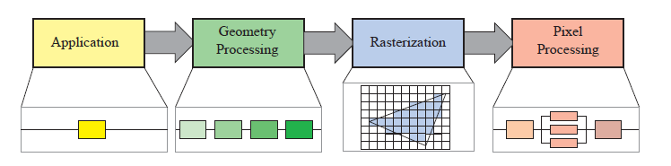

# hello pipeline

参考 : 有许多非常专业的网站提供了更加详细，全面的解释

[Learn OpenGL 主页](https://learnopengl-cn.github.io/)

[极客学院 曲面细分教程](http://wiki.jikexueyuan.com/project/modern-opengl-tutorial/tutorial30.html)

[Render Doc 官网](https://renderdoc.org/)

[DX OS 解释](https://docs.microsoft.com/en-us/windows/desktop/direct3d11/d3d10-graphics-programming-guide-output-stream-stage)

简写 : 在初次出现时会用全称，后续直接用简写代替
``` python
DrawCall              : "dc"      #一次渲染调用
# 4 个粗略分类的大阶段
Application           : "App_p"   #应用层面 阶段（CPU阶段)
Geometry Processing   : "g_p"     #几何处理 阶段
Rasterization         : "r_p"     #光栅化   阶段
Pixel Processing      : "p_p"     #像素处理 阶段
# 数个着色器或阶段的简称
Input Assembler Stage : "IA"      #输入装配 阶段
Vertex-Shader Stage   : "VS"      #顶点着色 阶段
Tessellation Stage    : "TS"      #曲面细分 阶段
Geometry-Shader Stage : "GS"      #几何着色 阶段
OutputStream Stage    : "OS"      #流输出   阶段
```

## 实时渲染的目的
```
Real-time rendering is concerned with rapidly making images on the computer.
```
>* 本质就是在计算机上绘制图片
>* rapidly (帧率)：
>>* 通常由 FPS(Frame Per Second) 来描述图片显示的频率
>>* video game : 30, 60, 72, +
>>* film : 24 (shutter system)

```
Movie projectors show frames at 24 FPS but use a shutter system to display each
frame two to four times to avoid flicker. This refresh rate is separate from the display
rate and is expressed in Hertz (Hz). A shutter that illuminates the frame three times
has a 72 Hz refresh rate.
```
大致含义: 一次 shutter 会点亮(illuminates) 一帧2-4 次

[知乎_电影为毛24](https://www.zhihu.com/question/20207871)

>>* VR : 150+

## 初步了解管线
```
the core component of real-time graphics, namely the graphics
rendering pipeline, also known simply as “the pipeline.”
```
```
The main function of the pipeline is to generate, or render, 
a two-dimensional image, 
given a virtual camera, three-dimensional objects, light sources, and more.
```

无论给出多少输入的情况下，管线的输出始终是一张二维的图片。比如：


左图中的，虚拟的摄像机只会渲染它“看”到的内容。

简单来说，将左图中的内容，绘制为右图，就是一个简单的管线流程。

```
A coarse division of the real-time rendering pipeline into 
four main stages—
application, geometry processing, rasterization, and pixel processing
```
我们将管线分为 4 个大阶段。



>* **2 个并行**的理解。
>>* 阶段的并行 ：如同工厂流水线一般，每个阶段依赖上一个阶段的结果，虽然他们保持着前后关系，
但在 60 FPS 的速率下，他们看起来就像是并行一样，但会出现 瓶颈问题，卡在最慢的阶段上。
（RTR 中举了个做汉堡的例子来说明瓶颈问题）
```
The pipeline stages execute in parallel, but they are stalled
until the slowest stage has finished its task.
```
>>* 阶段内的并行 ： 如同图内的 像素处理(Pixel Processing) 阶段，该阶段中有一个阶段的并行是对片元的并行处理。
但所有的并行，仍然在这一条流水线内,或者理解为一次 dc(DrawCall)。

>* **4 个阶段**的大致理解
>>* **Application** : 应用层阶段，其实就是CPU阶段，包括整个的游戏逻辑，
到碰撞检测，动画播放，CPU上的粒子计算，到如何绑定贴图都算
>>* **Geometry Processing**  : 几何处理，处理输入的几何数据，最明显的例子就是我们用的 MVP 矩阵。
以及 处理位置，裁剪视线空间以外的内容，等其他很多内容。
>>* **Rasterization** : 光栅化阶段，这个阶段完全不需要我们操心，写死在显卡上的（Fixed-Function)，
它最主要的工作就是实现了上下2个阶段的过度，输入顶点，寻找覆盖的像素，内插值计算，所以被单独拿了出来。
>>* **Piexl Processing** : 像素处理阶段，对光栅化后的内容做处理，往往都在这一步进行上色（执行各种酷炫算法），最后输出图片。

## 应用阶段
>* 基本功能:
>>* CPU 将需要进行渲染的内容提交给 GPU
>* 酷炫操作
>>* 减面算法，压缩贴图（等等），目的就是让提交给 GPU 的内容变少，减轻 GPU 的负担。
>>* Compute Shader(cs)，一种由API调用（DX11+），直接让GPU做运算的着色器。
>>* 软渲，全在CPU做的渲染（用CPU来实现管线，但因为CPU缺少了GPU高并发的能力，所以一般就是做做小demo）
>>* 多核处理 + GPU渲染，随着CPU的性能提升，我们可以充分利用CPU的多核特性，让dc的调用分布在多个线程上。
**TODO：暂时不了解，RTR 18.5**

## 几何处理
```
The geometry processing stage on the GPU is responsible for most of 
the per-triangle and per-vertex operations. 
```
几何阶段，就是 逐三角形+逐顶点 的处理过程


在RTR中，将几何处理主要分为 4 个部分，顶点着色，投影，裁剪，屏幕映射。
>* 可能这里跟 Learn OpenGL 教程上说的有出入，其实是 RTR 将一些矩阵的处理，
和一些在 GPU 上实现的不可编程的阶段，统一，称之为 **几何处理** 阶段。

### 顶点着色

#### 顶点着色的功能
```
There are two main tasks of vertex shading, namely, 
to compute the position for a vertex 
and to evaluate whatever the programmer may like to have as vertex output data, 
such as a normal and texture coordinates. 
```
顶点着色 2 个任务

1. 计算顶点位置

2. 计算顶点属性（比如法线和纹理坐标)

值得注意的点
>* 在三角形内部的点和线段上的点会进行插值，但插值的时机应该是在光栅化阶段完成。
因此在整个流程中，点仍然是点，线依然是线，三角形依然是三角形（可能被裁剪了会成为新的三角形）。
>* 在以前，顶点着色器会通过顶点属性信息，在这里计算出顶点的颜色，传递给下面的流程。
在 Learn OpenGL 的第一节绘制三角形中，我们就是通过设置每个顶点的颜色，再利用三角形内的插值，得到：


>* 因为这个原因，这个可编程的顶点处理的过程，被称作 顶点着色器(Vertex Shader)。但在现代的GPU中，
vs 更多的应用是在专门进行 顶点及相关数据的处理。

#### 顶点的位置计算
如何去计算顶点的位置，在这里借鉴 Learn OpenGL 的一张流程图。


在RTR中提及到的点:
```
This allows several copies (called instances) of the same model to have different locations,
orientations, and sizes in the same scene, without requiring replication of the basic
geometry.
```
>* 有一个叫做 instances 的技术，对于只是不同位置的同样模型 "the same model to have different locations"
可以用类似实例化的方式来实现，避免传入大量的 模型几何数据。
```
To produce a realistic scene, 
it is not sufficient to render the shape and position of objects, 
but their appearance must be modeled as well.
```
>* vs 除了计算位置，还需要处理存储在顶点中的材质数据，包括法线，颜色，纹理坐标，
这些信息同样会在光栅化的过程中做插值。

投影
>* 投影分为 2 种
>>* 正交投影
>>* 透视投影
>* 他们的视体积分别是，一个长方体和一个视椎体，其核心的表现都是乘上一个 4x4 的矩阵，
然后转换到 裁剪空间（clip coordinates）中。具体的数学计算流程不在这里讨论。


```
the z-coordinate is not stored in the image generated 
but is stored in a z-buffer
```
这里提及到，投影坐标的 z 不会存储在图片中，而是作为 z-buffer，以这种方式，将模型从3维投影到2维。

#### 可选的顶点处理流程
在RTR中，提到了3个 optional vertex processing，这个3个处理流程相互独立，他们取决于
硬件（目前来说，移动端没有大部分不支持）和需求。先做一部分简单的解释。


这是一个 OpenGL 的，可选的顶点处理流程的图。


这是一张 RenderDoc-DX 的图（这里没有 OS)。

>* tessellation，曲面细分，后面简写为 ts
>>* 粗略来说，ts 的目的就是让模型的三角形面数能随着模型距离摄像机位置，而进行变化。（GPU层的 LOD算法）
对于极远处的一个球体，它在我们屏幕上的显示就是几个像素点。而对于近距离观察的人脸，你肯定希望细节越多越好。
>>* ts 又分为 3 个部分，在 DX 中被称为：hull shader, tessellator, domain shader，在 OpenGL 中：
 Tessellation Control, Primitive Genertor,  Tessellation Evaluation Shader。他们的具体功能我会在后续提到。
>* geometry shader， 几何着色器，后面简写为 gs
>>* gs 的目的就是生成顶点，我们能够得到原来的顶点数据，在这个基础上生成我们想要的，点，线，或者面。
>>* 在 Learn OpenGL 的教程上，几何着色器一章中，我们看到实现了这样的效果：


>>* 其实这是2次dc的结果，一次原来的不变，一次画黄色的法线，我们可以略微调整一下得到一下的效果：


>>* 这只需要把三角形改成线即可。
>* output stream，输出流程，后面简写为 os
>>* os 在 openGL 中又称为 Transform Feed back
```
The purpose of the stream-output stage is 
to continuously output (or stream) vertex data 
from the geometry-shader stage 
(or the vertex-shader stage if the geometry-shader stage is inactive) 
to one or more buffers in memory
```
>>* 流输出的目的就是，获取 gs的输出，或者直接是 vs的输出。这些输出的几何数据，主要有 2 个途径获取
>>* os 的数据能够重新回到 输入装配阶段 （Input Assembler 后简称 IA)。顾名思义，IA 就是从用户填充的缓冲区中读取数据，并将数据装配为 **primitive**（这里称之为基元），交由 vs 使用的阶段。


>>* os 的数据也可以作为缓冲存下来，在这里可以被其他 shader 的load函数读取，也能从 CPU 中读取。


>>* **TODO：暂时不了解 os 的具体应用，后续碰到的话会补上**

### 裁剪
首先，在这里补上 **primitive** （基元）的定义。
```
At the end of the application stage, the geometry to be rendered is fed to the
geometry processing stage. 
These are the rendering primitives, i.e., points, lines, and triangles, 
that might eventually end up on the screen
```
基元，就是要被渲染的物体的基本单元。只能是点，线，三角形。上述过程中做的操作，都是对基元本身（本来就是一个点）
或者基元上的点（三角形的3个点和线段的2个点）做的处理。

需要理解的一点：物体是由 **基元** 构成的，基元是点，线，或者三角形。

而裁剪，正是针对 基元 进行的，保留在 unit-cube ( (−1,−1,−1) ~ (1, 1, 1) ) 的基元（或产生新的基元）。


### 屏幕映射
屏幕映射就是将经过裁剪后的 基元， 转换到窗口坐标上，需要注意的是，这里依然是带着 z 坐标的。


>* 在这里，不同的API（指 DX和GL等），会有所区别，比如哪里是 (0,0)，浮点数怎么对应像素点，
但本质的核心功能是一致的。

## 光栅化
```
the goal of the next stage is to find 
all pixels—short for
picture elements—that are inside the primitive
```
光栅化的目的，就是找到基元内部的所有像素。

如何判断覆盖像素的方法，这些参数是可以通过API去配置的。


这里的参数都可以通过 API进行调整，比如 Fill Mode 的设定，也可以实现我们在 gs 中实现的线框效果。

而在 Learn OpenGL 的 面剔除 一节中，也是修改这里的 Cull Mode 实现的。


```
it is split up into two functional substages: 
triangle setup (also called primitive assembly) 
and triangle traversal.
```
光栅化分为2个子阶段，三角形装配，三角形遍历。


#### 三角形装配
```
In this stage the differentials, edge equations, and other data for the triangle are computed
...
Fixedfunction hardware is used for this task.
```
在这个阶段，会计算基元对应三角形的，差分，边缘方程等各种数据。（为什么只有三角形？可能线段和点没必要算了）

个人理解就是，为下一步的计算，做各种的准备工作。

这个过程是直接写死在 GPU 中的。

#### 三角形遍历
```
Here is where each pixel that has its center (or a sample) covered by the triangle is
checked and a fragment generated for the part of the pixel that overlaps the triangle.
```
这是**个人实现**的一个遍历流程
>* 从(0,0)开始，逐像素进行检测
>>* 对于像素 a，遍历所有的基元进行检测
>>>* 对于像素 a，基元 E，判断 a 是否被 E 覆盖，若否，跳到 下一个基元继续循环
>>>* 因为 a in E, 所以对于基元 E，在 a 位置，生成一个片元 f
>>>* f 的属性，根据基元 E 做插值完成
>>* 继续下一个基元的检测
>* 继续下一个像素的检测

在这里，有许多光栅化的实现算法，又是一个非常大的坑。比如 Bresenham 算法等。

[Bresenham's line algorithm](https://en.wikipedia.org/wiki/Bresenham%27s_line_algorithm)

当然，真正的三角形遍历的算法不可能这么暴力，肯定有简化和优化的过程，但得到的结果是：
```
All pixels or samples that are inside
a primitive are then sent to the pixel processing stage
```
所有在一个基元内的像素或采样结果（这里就是，片元），会被传递到 ps 阶段。
>* 这些过程都是在 GPU 写好的，不过我们可以通过API来调整某些配置

## 像素处理


像素处理阶段，会分为像素的着色和合并阶段，对应为：


### 像素着色器
```
Any per-pixel shading computations are performed here, using the interpolated shading data as input.
```
在这里，我们使用从上个阶段，通过插值得来的数据，来进行逐像素的渲染。

在这个阶段，我们使用 顶点着色器（Pixel Shader ， ps）来绘制每个**片元**的颜色。这是 GPU 编程的核心。

在这里，我们可以做 Phong 光照，pbr，csm 等等高级的算法。

但输出是统一的，就是该**片元**的颜色。

这是一个最简单的 ps。


### 合并阶段
```
The information for each pixel is stored in the color buffer, which is a rectangular array
of colors (a red, a green, and a blue component for each color).
```
首先，这里有一个颜色缓冲的定义，它用来存储最终显示的颜色。（当然，这里还有其他缓冲）

```
It is the responsibility
of the merging stage to combine the fragment color produced by the pixel shading stage
with the color currently stored in the buffer.
```
合并阶段的任务就是，将片元上的颜色，与颜色缓冲区做合并。（或者其他信息，比如模板，深度，等)

合并阶段，是不可编程控制的，但我们也可以通过API，来进行各种合并操作的配置。


合并阶段的几个主要功能。

使用 **Z-Buffer** 解决物体遮挡关系问题

```
If the computed z-value is greater than the z-value in the z-buffer, then the
color buffer and the z-buffer are left untouched.
```
如果新的z值比z缓冲上的z值要小，这个颜色缓冲和z缓冲就会被记录下来。

```
However, the z-buffer stores only a single depth at each point on the screen, 
so it cannot be used for partially transparent primitives.
Transparency is one of the major weaknesses of the basic z-buffer.
```
z缓冲机制，解决不了透明度的问题，我们后续会通过其他的算法来解决。**TODO：关于透明度的渲染，一直是个很难以处理的问题**

除了 color buffer，z buffer，还有其他的缓冲，在这里，提及到了 alpha buffer，stencil buffer。

alpha buffer就是存储透明度的缓冲，不过现在似乎直接存在了颜色缓冲中。（不是很清楚）

```
The stencil buffer is an offscreen buffer used to record the locations of the rendered primitive.
```

stencil buffer 是一块额外的缓冲区。每个像素对应的位置包含了 8个bit （一般来说）

其可配置的内容有:


其中裁剪的功能，可以通过模板测试来实现。

```
When the primitives have reached and passed the rasterizer stage, 
those that are visible from the point of view of the camera are displayed on screen. 
The screen displays the contents of the color buffer. 
To avoid allowing the human viewer to see the primitives as 
they are being rasterized and sent to the screen, 
double buffering is used.
```
双缓冲机制

